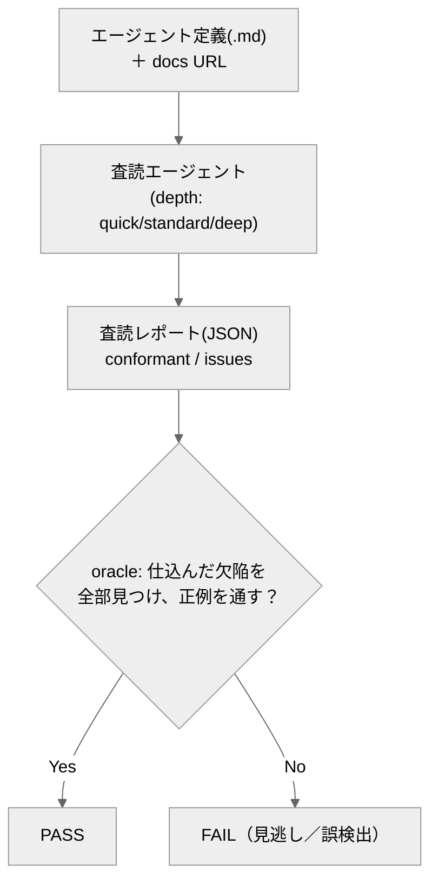

# agent-spec-reviewer

*A Claude Code sub-agent that reviews agent definition files for spec conformance and obsolescence, paired with a deterministic oracle that scores the review's detection power on labeled defect fixtures.*

Claude Code のサブエージェント定義（`.claude/agents/*.md`）を**仕様適合＋陳腐化の観点で査読する**エージェントと、**査読の検出力をラベル付き見本で採点する**オラクル（採点プログラム）。

専門用語を使わない説明は [説明書.md](説明書.md) にあります。

## 概要

「このエージェント定義は Claude Code の仕様に合っているか？」を毎回 docs を読んで手で確かめるのは手間です。
このリポジトリは、その査読を自動化するエージェントと、その査読が信頼できるかを測る採点係（オラクル）です。

査読は構造化レポート（JSON）で返します：仕様適合（`conformant`）と、見つかった問題（`issues`：仕様違反も陳腐化も）。
深さ（`depth`：quick / standard / deep）で粘りを指定でき、`deep` は公式 docs を実際に取得して照合します。

## クイックスタート

必要なもの：Python 3 のみ。**リポジトリのルートで実行**。

```bash
python eval/oracle.py            # お手本の査読(reference)を採点 → PASS
python eval/oracle.py --selftest # オラクル自身を検証（②で雑な査読に FAIL が出るのが正常）
```

→ ①は採点表に `PASS`、②は最後に `## オラクル判定: PASS`。どちらも終了コード 0。

## エージェントの動かし方

`.claude/agents/agent-spec-reviewer.md` の指示で、`eval/corpus/` の各定義を査読し、結果を `{ファイル名: {conformant, issues}}` の JSON にします。それを `python eval/oracle.py --verdicts <JSONパス>` で採点。

## しくみ



## 合否（eval）
正例＋既知欠陥（name 欠落・description 欠落・frontmatter 壊れ・陳腐化した回避策）の見本に対し、査読が各見本の欠陥を過不足なく検出し（期待 issue 集合と完全一致）、正例を通せば PASS。浅い査読（陳腐化見逃し）も、過剰報告（期待外 issue の併記・語彙外キー）も FAIL。

## ファイル構成
- `.claude/agents/agent-spec-reviewer.md` … 査読エージェント定義（depth・docs URL の WebFetch 対応）
- `eval/oracle.py` … 採点係（検出力をラベルで採点・`--selftest` 内蔵）
- `eval/corpus/` … 査読対象の見本（`good_agent`＋`broken_*`）／`eval/selftest/` … 採点係検証用の査読結果サンプル
- `design/design.md` … 設計の考え方

---
自作 AI エージェント集（評価駆動開発の実証）の一つ。背景は [design/design.md](design/design.md)。
